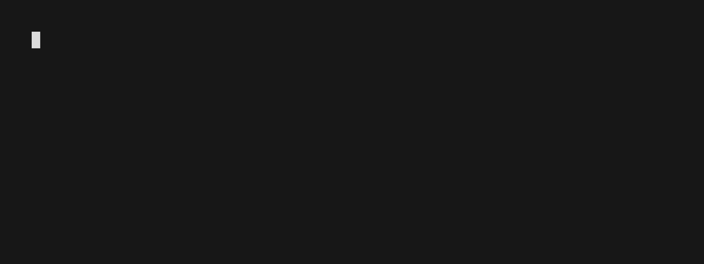

# Sunbeam



> **Warning**: This is a work in progress. The API is not stable and may change at any time.

## Roadmap

- Finalize API V1, Write Documentation
- An extension system inspired by [Github Cli](https://docs.github.com/en/github-cli/github-cli/creating-github-cli-extensions)
- Support for running the sunbeam host on a remote machine
- Cross platform UI (Using xterm.js and wails.io)

## Installation

```bash
go install github.com/pomdtr/sunbeam@latest
```

## Development

## Libraries

- [santhosh-tekuri/jsonschema](https://github.com/santhosh-tekuri/jsonschema): For validating the config file and scripts output

### Dependencies

- Go >= 1.19

### Running the TUI

```bash
SUNBEAM_LOG_FILE=$PWD/debug.log go run main.go`
```

The logs will be redirected to the `debug.log` file, use `tail -f debug.log` to follow them.
