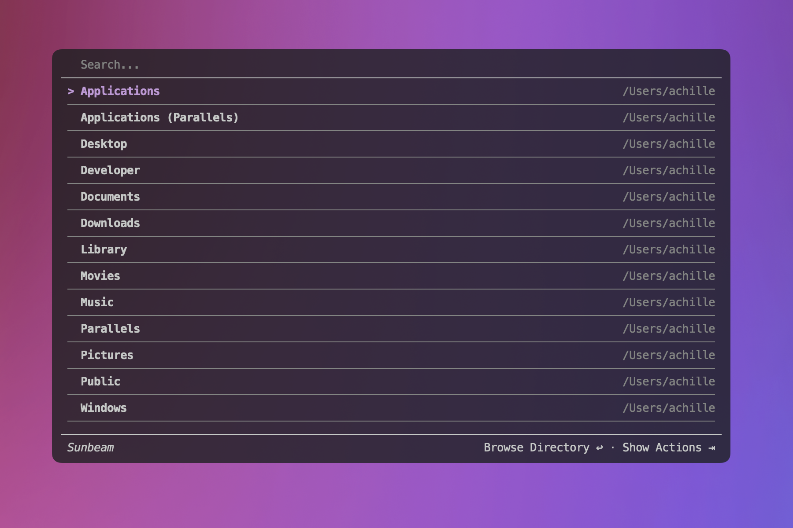
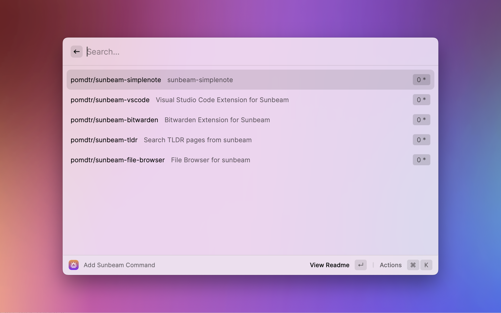

<div class="oranda-hide">

# Sunbeam

[](https://codesandbox.io/p/github/pomdtr/sunbeam/main)

</div>

Sunbeam is a command-line launcher, inspired by [fzf](https://github.com/junegunn/fzf), [raycast](https://raycast.com) and [gum](https://github.com/charmbracelet/gum).

It allows you to build interactives UIs from simple scripts.


## Installation

### Brew (macOS/Linux)

```bash
brew install pomdtr/tap/sunbeam
```

### Scoop (Windows)

```bash
scoop bucket add pomdtr https://github.com/pomdtr/scoop-bucket.git
scoop install pomdtr/sunbeam
```

### From source

```bash
go install github.com/pomdtr/sunbeam@latest
```

You can also download the latest release from the [releases page](https://github.com/pomdtr/sunbeam/releases/latest).

## Why sunbeam?

I love TUIs, but I spent way to much time writing them.

I used a lot of application launchers, but all of them had some limitations.

Sunbeam try to address these limitations:

### Sunbeam runs on all platforms

Sunbeam is written is distributed as a single binary, so you can run it on any platform. The sunbeam extension system is also designed to be cross-platform.



### Sunbeam is language agnostic

Sunbeam communicates with your extensions using JSON, so you can use any language you want to build your scripts.
The only requirement is that the script is executable and outputs a JSON object conforming to the [Sunbeam JSON Schema](./schemas/page.schema.json) on stdout.


### Any github repository can be used as an extension

Sunbeam is designed to be extended. Any github repository containing a `sunbeam-extension` executable can be installed using the `sunbeam install` command.

You can also distribute your extensions as a golang binary published on github releases, and even automatically compile them thanks to a [github action](https://github.com/pomdtr/sunbeam-extension-precompile).

### Sunbeam supports custom clients

Sunbeam comes with a built-in TUI to interact with your scripts, but you can also use any other client.

Currently the only alternative client is [sunbeam-raycast](https://github.com/pomdtr/sunbeam-raycast).



## Inspirations / Alternatives

Sunbeam wouldn't exist without the work of other people. Here are some projects that inspired sunbeam:

- [raycast](https://raycast.com): Sunbeam shamelessly copy most of raycast UX. Even the project name is a reference to raycast.
- [fzf](https://github.com/junegunn/fzf): Sunbeam tries to take inspiration from fzf, but it's not a drop-in replacement. Sunbeam is designed to be used as a launcher, not as a fuzzy finder.
- [kit](https://www.scriptkit.com/): Kit is another script-focused launcher. Sunbeam gists extensions are inspired by kit scripts.
- [gum](https://github.com/charmbracelet/gum): Sunbeam is powered by charm libraries, and can be seen as a alternative spin on gum. Gum is invoked by scripts, while sunbeam invokes scripts.
- [slapdash](https://slapdash.com): The sunbeam event loop was inspired by slapdash. Sadly, slapdash doesn't seem to be updated anymore.
- [gh](https://cli.github.com): The sunbeam extension mechanism is a copycat of the gh extension mechanism.
