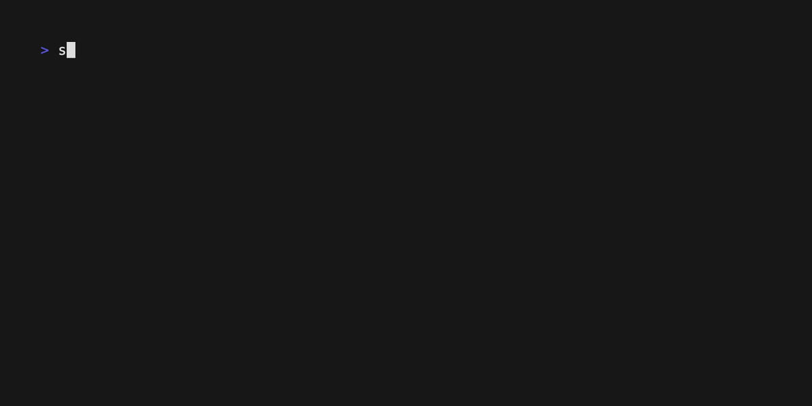

# Devdocs (Bash)

## Requirements

- [curl](https://curl.haxx.se/)

## Demo



## Install

```bash
sunbeam command add devdocs https://raw.githubusercontent.com/pomdtr/sunbeam/main/docs/examples/devdocs/devdocs.sh
```

## Usage

```bash
sunbeam devdocs # List all docsets
sunbeam devdocs <docset-slug> # List all entries for a docset
```

## Code

```bash
{{#include ./sunbeam-command}}
```
