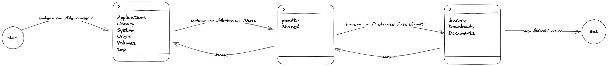

# Usage

## Running Sunbeam

To run sunbeam, you need to provide a command as the first argument. Sunbeam will run the command and interpret it's output as a page.

```bash
sunbeam run ./file-browser.py
```

Once the output is shown, you can use the arrow keys to navigate the UI, and press enter to select an item.
Use the `tab` key to show all available actions for the selected item.

Depending on the action, sunbeam may:

- Open an URI in the default application/browser
- Copy text to the system clipboard
- Run a command, and display its output on stdout
- Reload the current page
- Push a new page to the navigation stack
- Pop the current page from the navigation stack (escape key)

## Extending Sunbeam

Sunbeam is designed to be extended. You can write your own commands in any language, as long as they can output JSON.

Basically, a sunbeam script is written like a classic CLI app. However, instead of writing human-readable text to stdout, it writes JSON payload confirm to the [Sunbeam JSON Schema](https://raw.githubusercontent.com/pomdtr/sunbeam/main/schemas/page.schema.json).

### Writing a static list

The simplest sunbeam script you can write is a json file, that describe a static list.

```json
{{#include ./static-list.json}}
```

Create a file named `sunbeam.json` and run `sunbeam read sunbeam.json` to show the list.

### Writing a dynamic list

However, sunbeam scripts can be much more powerful. They can be used to generate dynamic lists, or to interact with external services.

Let's generate the list of files in the current directory.

```python
{{#include ./dynamic-list.py}}
```

Save this script as `file-browser.py`, and run `sunbeam run python3 file-browser.py` to show the list.

### Adding Arguments

Let's add some options to our script to make it more useful.

```python
{{#include ./dynamic-list-with-args.py}}
```

You can now run `sunbeam run file-browser.py /tmp` to show the list of files in the `/tmp` directory, or `sunbeam run -- python3 file-browser.py --show-hidden` to show hidden files in the current directory.

Notice that we used the `--` argument separator to pass arguments to the script. This is required because `sunbeam run` also accepts flags, and we don't want it to interpret them.

### Adding Navigation

This is nice, but we can do better. A full-blown file browser would allow us to navigate through directories.
In sunbeam, we can push a new page by using a `push` action.

Sunbeam will run the command, and push the output to the navigation stack.
You can repeat this process to create a navigation tree.
The user can then use the escape key to go back to the previous page.



You can find a working file browser example [here](../examples/file-browser.md).

## Displaying Text

If you want to display a block of text to the user, you can use the `detail` page type:

```json
{
  "type": "detail",
  "preview": {
    "text": "Hello World!"
  }
}
```

Detail view support actions, so you can add a button to the page:

```json
{
  "type": "detail",
  "preview": {
    "text": "Hello World!"
  },
  "actions": [
    {
      "type": "run",
      "command": "echo Hello World!"
    }
  ]
}
```

## Handling User Input

You may want to ask the user for some input before running a command.

You can add an array of inputs to every sunbeam actions, and reference their value in the command.

```json
{
  "type": "run",
  "command": "echo ${input:name}",
  "inputs": [
    {
      "name": "name",
      "type": "textfield",
      "title": "Name",
      "title": "What's your name?"
    }
  ]
}
```

When activating the action, the user will be prompted for the input value.
Sunbeam support the following input types:

- `textfield`: A simple text input
- `textarea`: A multiline text input
- `checkbox`: A checkbox
- `dropdown`: A dropdown menu

### What's next?

This is just the tip of the iceberg. Sunbeam can show detail pages, prompt the user for input, and much more.

To learn more, check out the [Sunbeam types](../types.md) and the provided [examples](../examples/index.md).

In order to run the examples, you can either copy/paste them or just clone the sunbeam repository, go to the `docs/examples` directory and run `sunbeam < sunbeam.json`.

> **Warning** Some examples require external dependencies. Please refer to the README of each example for more information.
