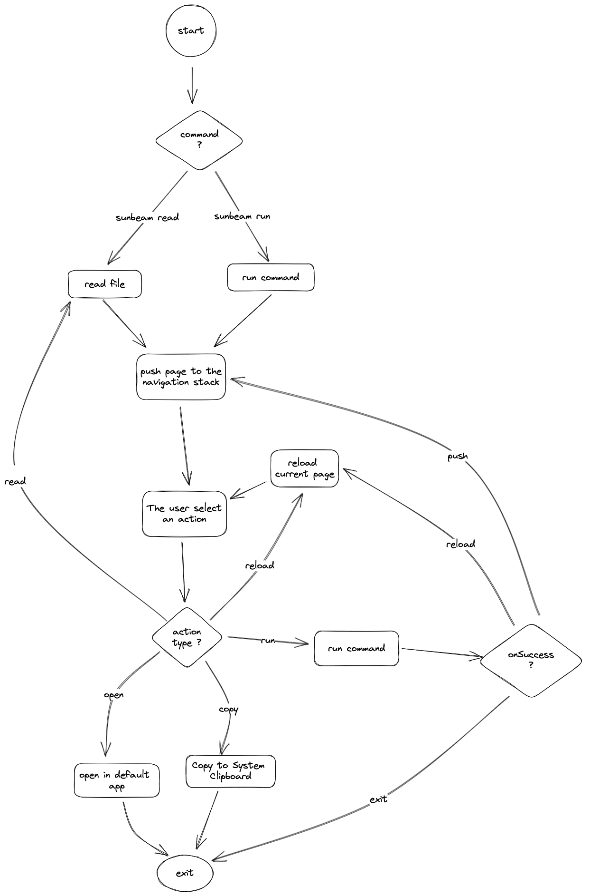

# Usage

## Running Sunbeam

To run sunbeam, you need to provide a command as the first argument. Sunbeam will run the command and interpret it's output as a page.

```bash
sunbeam -- file-browser.py
```

Once the output is shown, you can use the arrow keys to navigate the UI, and press enter to select an item.
Use the `tab` key to show all available actions for the selected item.

Depending on the action, sunbeam may:

- Open an URI in the default application/browser
- Copy text to the system clipboard
- Run a command, and display its output on stdout
- Reload the current page
- Push a new page to the navigation stack
- Pop the current page from the navigation stack (escape key)

## Extending Sunbeam

Sunbeam is designed to be extended. You can write your own commands in any language, as long as they can output JSON.

Basically, a sunbeam script is written like a classic CLI app. However, instead of writing human-readable text to stdout, it writes JSON payload following the [Sunbeam JSON Schema](../schema.md).

### Writing a static list

The simplest sunbeam script you can write is a json file, that describe a static list.

```json
{{#include ./static-list.json}}
```

Create a file named `sunbeam.json` and run `sunbeam read sunbeam.json` to show the list.

### Writing a dynamic list

However, sunbeam scripts can be much more powerful. They can be used to generate dynamic lists, or to interact with external services.

Let's generate the list of files in the current directory.

```python
{{#include ./dynamic-list.py}}
```

Save this script as `file-browser.py`, make it executable using `chmod +x ./file-browser.py` and run `sunbeam run ./file-browser.py` to show the list.

### Adding Arguments

Let's add some options to our script to make it more useful.

```python
{{#include ./dynamic-list-with-args.py}}
```

You can now run `sunbeam run file-browser.py /tmp` to show the list of files in the `/tmp` directory, or `sunbeam run -- file-browser.py --show-hidden` to show hidden files in the current directory.

Notice that we used the `--` argument separator to pass arguments to the script. This is required because sunbeam also accepts flags, and we don't want it to interpret them.

### Adding Navigation

This is nice, but we can do better. A full-blown file browser would allow us to navigate through directories.
In sunbeam, we can push a new page by using a `run` action associated with the`onSuccess` event.

This schema describe the sunbeam event loop.



Let's update our file browser to support navigation.

```python
{{#include ../examples/file-browser/file-browser.py}}
```

### What's next?

This is just the tip of the iceberg. Sunbeam can show detail pages, prompt the user for input, and much more.

To learn more, check out the [Sunbeam JSON Schema](../schema.md) and the provided [examples](../examples).

In order to run the examples, just clone the sunbeam repository and run `sunbeam` from the root directory.

> **Warning** Some examples require external dependencies. Please refer to the README of each example for more information.
