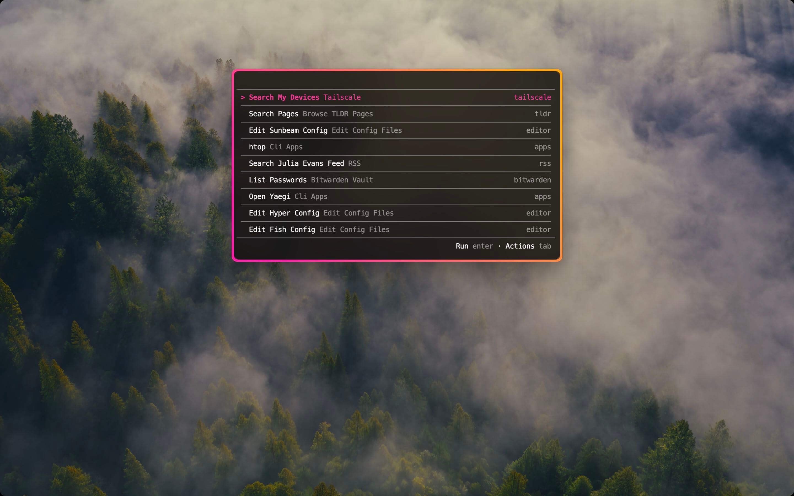

# Introduction

Sunbeam is a general purpose CLI launcher. It allows you to wrap your tools in slick UIs with a few lines of code, using the language of your choice.

You can think of it as a mix between an application launcher like [raycast](https://raycast.com) or [rofi](https://github.com/davatorium/rofi) and a fuzzy-finder like [fzf](https://github.com/junegunn/fzf) or [telescope](https://github.com/nvim-telescope/telescope.nvim).
